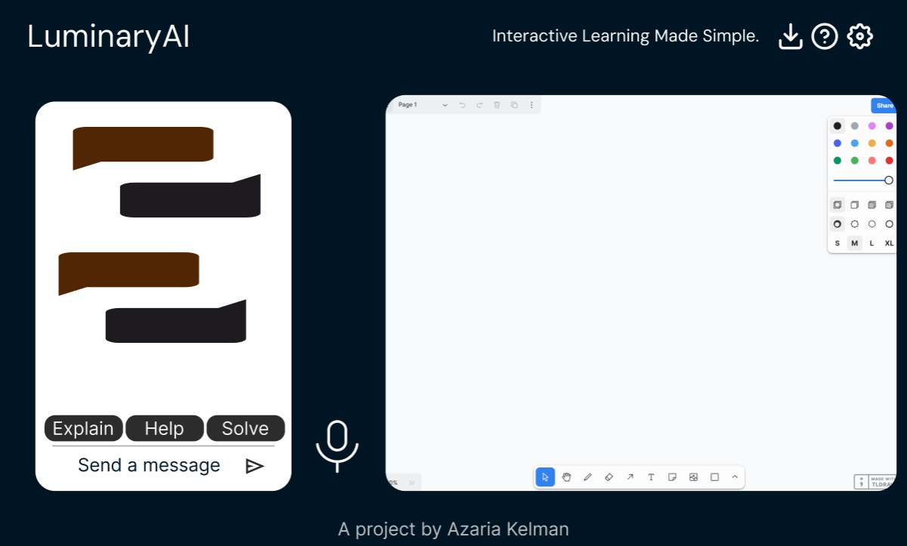

# TutorFlowAI
## A project by [Azaria Kelman]((mailto:azaria.kelman@mail.utoronto.ca))
Integrates real-time audio, a Large Language Model (LLM), a chatbot interface, and a digital whiteboard to provide an interactive and personalized tutoring experience.

#### Table of Contents
1. [Introduction](#TutorFlowAI)
2. [Installation](#installation)
3. [TODO](#todo)
4. [Color Scheme](#color-Scheme)
5. [Contributing](#contributing)

#### Rough sketch:

#### Installation
- Double check on new device:
1. Clone the repository: `git clone https://github.com/azariak/TutorFlowAI.git`

2. Install dependencies: `npm install`

3. Run the project: `npm run dev`

#### Dependencies
See `package.json` for complete, updated list.
- "@google/generative-ai": "^0.21.0",
- "dotenv": "^16.4.7",
- "license-report": "^6.7.1",
- "react": "^18.3.1",
- "react-dom": "^18.3.1",
- "react-markdown": "^9.0.1",
- "reactjs-popup": "^2.0.6",
- "tldraw": "^3.6.1"

#### TODO: 
- refactor code, improve readme
- api to work on vercel and cloudfare and npm run dev
- user able to add API in case rate limits hit
- refactor react-markdown to LLM-UI, add streaming
- optimize help popup for mobile
- consider making PWA
- Adjust size of whiteboard & chat by dragging with reset to default
- realtime mic. support within chat window
- light/dark mode
- deselect chat when switching to whiteboard so keyboard does not popup

#### Color Scheme
- Off-white: #FFECD1
- Background: #001524
- Bot message: #78290F
- Pop-up background: #000000d9

#### ⭐ Support the Project
- If you find this project helpful or interesting, please consider giving it a star on GitHub! 
- Feel free to [create issues](https://github.com/azariak/TutorFlowAI/issues/new/choose) or forks to contribute code
