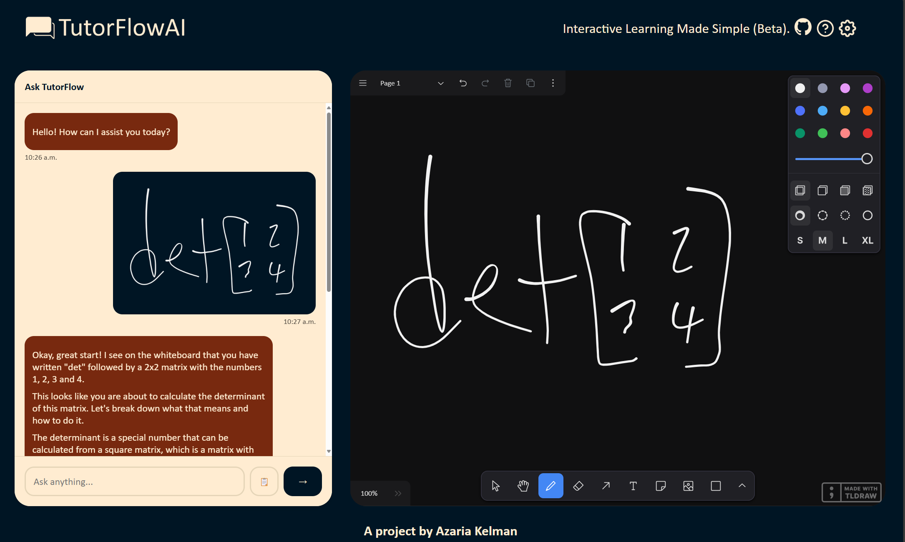

# TutorFlowAI
## A project by [Azaria Kelman]((mailto:azaria.kelman@mail.utoronto.ca))
Integrates real-time audio, a Large Language Model (LLM), a chatbot interface, and a digital whiteboard to provide an interactive and personalized tutoring experience.

#### Table of Contents
1. [Introduction](#TutorFlowAI)
2. [Installation](#installation)
3. [TODO](#todo)
4. [Color Scheme](#color-Scheme)
5. [Contributing](#contributing)

#### Screenshot:

#### Installation
1. Clone the repository: `git clone https://github.com/azariak/TutorFlowAI.git`

2. Install dependencies: `npm install`

3. Run the project: `npm run dev`

4. Input your Gemini API Key in settings

#### Dependencies
See `package.json` for complete, updated list.
- "@google/generative-ai": "^0.21.0",
- "dotenv": "^16.4.7",
- "license-report": "^6.7.1",
- "react": "^18.3.1",
- "react-dom": "^18.3.1",
- "react-markdown": "^9.0.1",
- "reactjs-popup": "^2.0.6",
- "tldraw": "^3.6.1"

#### TODO: 
- Touchscreen support for drag to resize
- Bug: Autoscroll in chat does not always work for whiteboard images
- api to work on vercel and cloudfare and npm run dev
- fallback to server when user api key fails
- refactor react-markdown to LLM-UI, add streaming
- consider making PWA
- realtime mic. support within chat window
- deselect chat when switching to whiteboard so keyboard does not popup
- Add analytics tag to track specific user actions
- Use speed tests to optimize load speed
- Fix mobile auto scroll bug (maybe caused by CSS size discrepancies)
- Fix ability to scroll on whiteboard (or provide alternative up/chat button or smtg similar)
- Refactor such that chat.jsx relies on generate.js even for localStorage API key to follow SRP and avoid duplicate code
- Merge popup css from header/footer css
- Import color scheme in various CSS from one central file, to allow easier color theming with changing themes from settings
- Fix `Unexpected end of JSON input` error to notify the user to configure their API key, test API call fails, better error handling
- Merge common elemts of generate.js and geminiService.JS
- The AI chat should be able to help users learn to use the app. Add to system message, and indicate this in help menu.
- Eliminate autoscroll for messages in the chat when the message is too big for the chat box, keep for images and short messages. Basically max out the autoscroll to the size of chat window

#### Color Scheme
- Off-white: #FFECD1
- Background: #001524
- Bot message: #78290F
- Pop-up background: #000000d9

#### ⭐ Support the Project
- If you find this project helpful or interesting, please consider giving it a star on GitHub! 
- Feel free to [create issues](https://github.com/azariak/TutorFlowAI/issues/new/choose) or [pull requests](https://github.com/azariak/TutorFlowAI/pulls) to contribute to the source code
