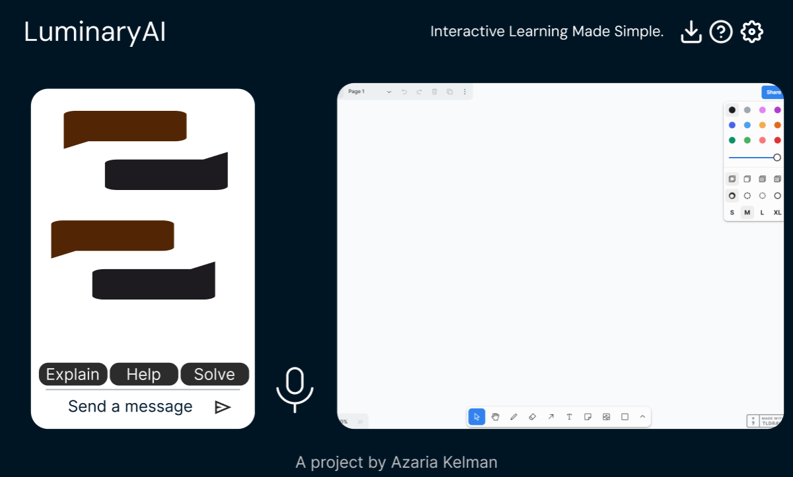

# TutorFlowAI
## A project by Azaria Kelman
Integrates real-time audio, a Large Language Model (LLM), a chatbot interface, and a digital whiteboard to provide an interactive and personalized tutoring experience.

#### Rough sketch:

#### Dependencies
- TLDRaw
- Node.js
- Vite with React
- Gemini API
- Python: os, dotenv, google.generativeai, PIL
- JS: @google/generative-ai, sharp, dotenv

#### TODO: 
Create virtual environment, requirements.txt, auto select draw tool, rounded corner, refactor, seperate color pallete, add stuff to readme
md, whiteboard image, width bug

#### Color Scheme
-  [Palette - Coolors](https://coolors.co/palette/001524-15616d-ffecd1-ff7d00-78290f)
